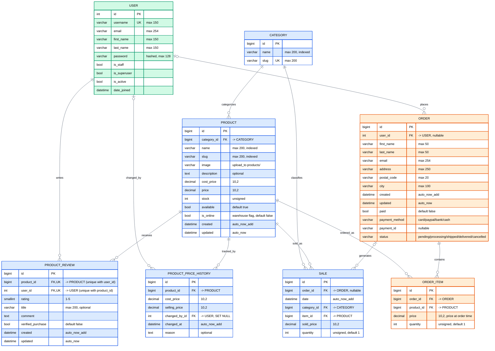

### Entity–Relationship Diagram

The diagram below is rendered natively by GitHub (Mermaid). A raster copy is
available at [`db-schema.jpg`](db-schema.jpg) and the standalone version with
full notes at [`DB-SCHEMA.md`](DB-SCHEMA.md).

> **Legend** — `PK` primary key · `FK` foreign key · `UK` unique key ·
> `||--o{` one-to-many (mandatory parent) · `|o--o{` one-to-many (nullable parent).

> The **shopping cart is session-based** (`request.session['cart']`) and has **no
> database table**, so it does not appear above.
>
> **`PRODUCT_REVIEW`** has a composite `UNIQUE (product_id, user_id)` constraint
> — one review per user per product.